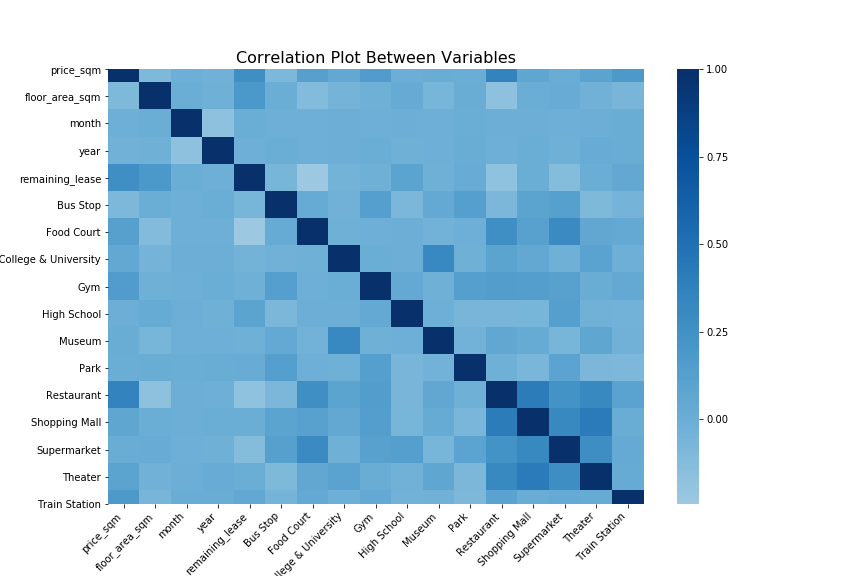
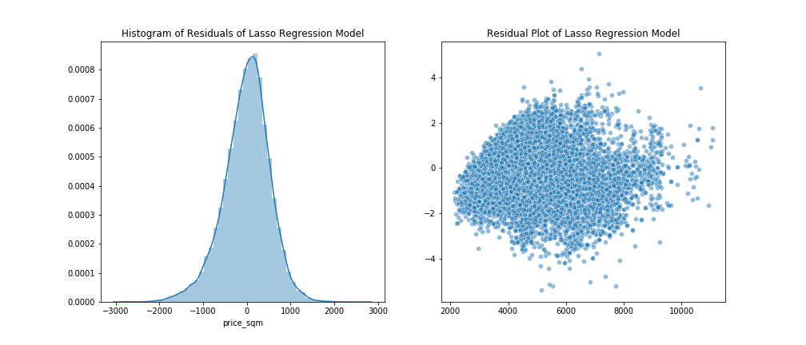
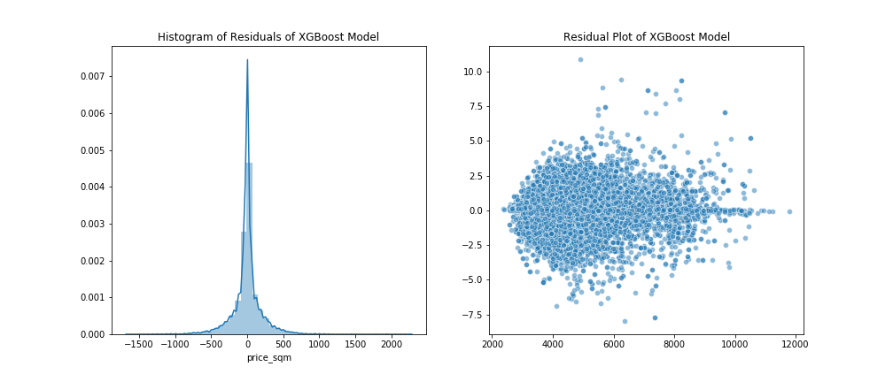
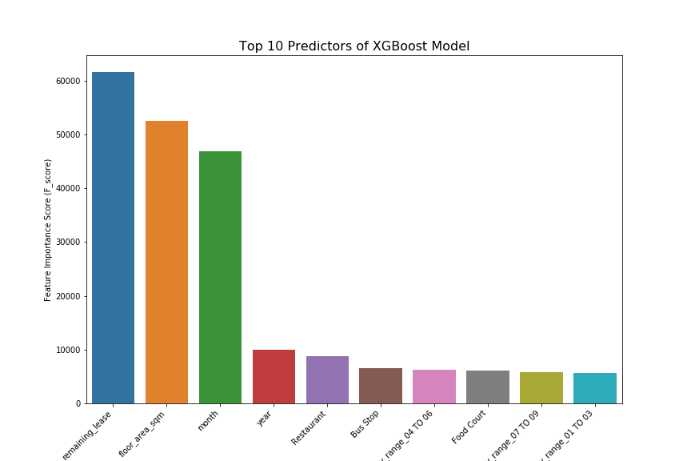
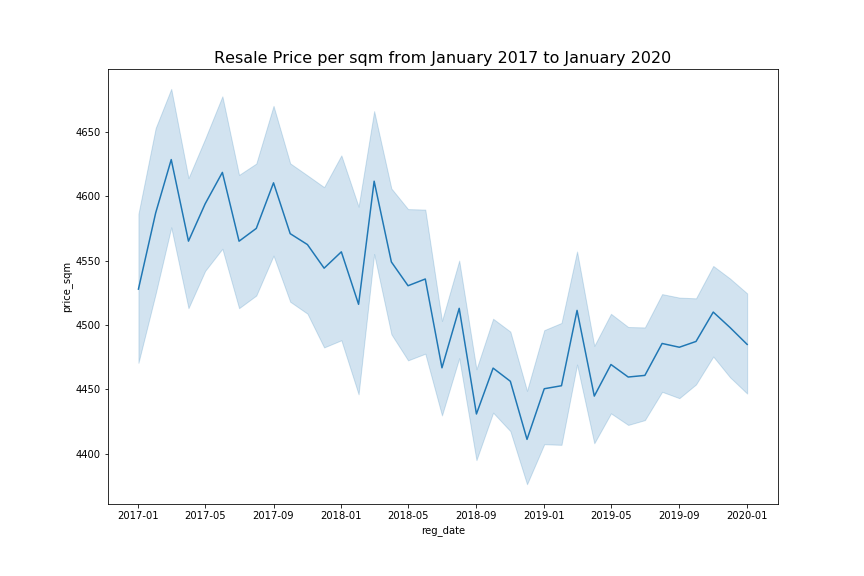
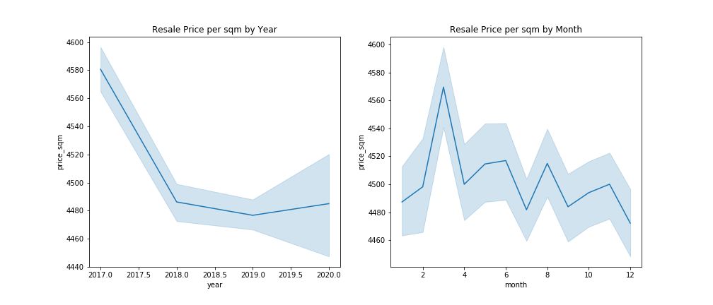
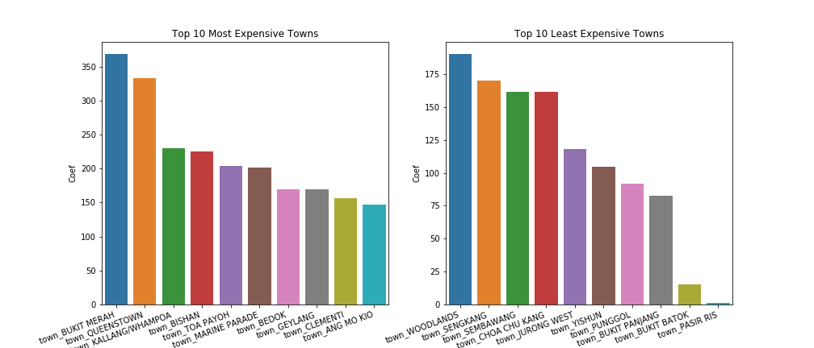

```python
import ipywidgets as widgets
from IPython.display import display, HTML

javascript_functions = {False: "hide()", True: "show()"}
button_descriptions  = {False: "Show code", True: "Hide code"}


def toggle_code(state):

    """
    Toggles the JavaScript show()/hide() function on the div.input element.
    """

    output_string = "<script>$(\"div.input\").{}</script>"
    output_args   = (javascript_functions[state],)
    output        = output_string.format(*output_args)

    display(HTML(output))


def button_action(value):

    """
    Calls the toggle_code function and updates the button description.
    """

    state = value.new

    toggle_code(state)

    value.owner.description = button_descriptions[state]


state = False
toggle_code(state)

button = widgets.ToggleButton(state, description = button_descriptions[state])
button.observe(button_action, "value")

display(button)
```


<script>$("div.input").hide()</script>


    ToggleButton(value=False, description='Show code')


```python
# Import required libraries
import numpy as np
import pandas as pd
```

<h1><center>Resale Price Prediction of HDB Resale Flats in Singapore</center></h1>
<h3 style="margin:0"><center>Lee Gang</center></h3>
<h3 style="margin:0"><center>29 February 2020</center></h3>

## Executive Summary

This project attempts to construct a high accuracy predictive model using publicly available transaction data and nearby venues data from Foursquare API to predict the resale price for HDB Flats in Singapore. The purpose of the project is to provide an easily accessible and free-to-use application that potential buyers and sellers of HDB Resale Flats can use to get a quick and accurate estimate of the resale price of a HDB Flat.

A high performing model is successfully built using the **Extreme Gradient Boosted Trees** algorithm, achieving a mean absolute error of only **S\\$122** per square meter, or **2.7\%** of average resale price. Around 66\% of all predictions will have an error of less than **S\\$207**, while 95\% of all predictions will have an error of less than **S\\$406**. The predictive model is able to explain **97\%** of the variance in the data.

## Table of Contents

1. [Introduction](#introduction)
2. [Methodology](#methodology)
3. [Results and Discussion](#results)
4. [Conclusion](#conclusion)
5. [References](#references)

## 1. Introduction <a name="introduction"></a>

### 1.1 Business Problem

Property valuations are usually costly and take time to prepare. Buyers and sellers of properties generally resort to comparing recent transaction prices of nearby and similar properties to estimate the property value. However, there are several limitations to this approach. Firstly, there might be limited transactions within the nearby vicinity. Secondly, the evaluation of similarity between properties is highly subjective, with a wide range of factors that might contribute to the final transaction price of a particular property.

In the context of Singapore, a property valuation report is required and can only be requested after an Option To Purchase (OTP) is granted by the seller of a HDB unit to the buyer. The amount of loan that the buyer can take up will depend on the property value as stated in the valuation report, or the offer price stated in the OTP, whichever lower. A buyer may potentially face the situation where the offer price is higher than the valuation price, therefore requiring an upfront additional cash payment for the difference in value. If the buyer decides to not exercise the OTP, he/she will be forfeiting the deposit paid as part of the OTP. As such, the buyer will face significant financial risk if the assessment of the property price is not conducted diligently. On the other hand, a common challenge faced by sellers are the price setting of properties. Overpricing and underpricing properties will often result in loss of profit or prolonged holding of the property.

As such, this project aims to develop a predictive model to provide both sellers and buyers a quick and easy way to estimate a property's value without spending a single cent. However, as the focus of this project is to develop a predictive model with high accuracy, we will not be delving deep into the effects of various predictors on the estimated price.

### 1.2 Scope and Background

Singapore's residential property market can be categorized into the public housing market, and the private housing market. The private housing market generally consist of condominiums or landed property developed by private property developers, and does not have any restrictions or requirements in regards to the buyers' citizenship. In contrast, public housing in Singapore is managed by the Housing and Development Board (HDB), and usually are on a 99-years leasehold basis. These high-rise apartments or flats are generally located within housing estates, which are self-contained satellite towns with schools, supermarkets and other facilities. These residential properties accounts for over 80% of the Singapore Resident population's housing needs<sup>[[1](#Ref1)]</sup>, and are called HDB Flats. However, HDB flats and are only available for purchase to Singaporean Citizens and Permanent Residents. 

Strictly speaking, only Singaporean Citizens are allowed to purchase new HDB flats. The price of the new HDB flat is set by the government agency and the entire process from application to occupation takes around two to four years. Singaporean Permanent Residents and Singaporean Citizens who do not want to wait for such long periods of time will have to purchase HDB flats from the resale market, where property prices are decided by various market forces.

In view of the relative high transaction volume of HDB resale flats and free market pricing, we will focus on building a prediction model to estimate the transaction price for HDB Resale Flats for this project.

## 2. Methodology <a name="methodology"></a>

### 2.1 Data Sources and Assumptions

All transactions data on HDB Resale Flats are made available publicly at **Data.gov.sg** through their API every month<sup>[[2](#Ref2)]</sup>. The transactions exclude resale transactions that may not reflect the full market price such as resale between relatives and resale of part shares. We will only utilize transaction data from 2017 to 2020 due to a different assumption and data classification methods adopted by HDB prior to 2017. The HDB Resale Flats transaction data contains information on the address, floor area, transaction price, transaction registration date and other information regarding the property such as property type and storeys.

A sample header of the HDB Resale Flats transaction data is as below:


```python
df_hdb = pd.read_csv('./Data/dat_hdb.csv')
df_hdb.head()
```


<div>
<style scoped>
    .dataframe tbody tr th:only-of-type {
        vertical-align: middle;
    }

    .dataframe tbody tr th {
        vertical-align: top;
    }

    .dataframe thead th {
        text-align: right;
    }
</style>
<table border="1" class="dataframe">
  <thead>
    <tr style="text-align: right;">
      <th></th>
      <th>town</th>
      <th>flat_type</th>
      <th>flat_model</th>
      <th>floor_area_sqm</th>
      <th>street_name</th>
      <th>resale_price</th>
      <th>month</th>
      <th>remaining_lease</th>
      <th>lease_commence_date</th>
      <th>storey_range</th>
      <th>_id</th>
      <th>block</th>
    </tr>
  </thead>
  <tbody>
    <tr>
      <th>0</th>
      <td>JURONG EAST</td>
      <td>3 ROOM</td>
      <td>New Generation</td>
      <td>67.0</td>
      <td>JURONG EAST ST 21</td>
      <td>270000.0</td>
      <td>2018-07</td>
      <td>63 years 08 months</td>
      <td>1983</td>
      <td>10 TO 12</td>
      <td>1</td>
      <td>214</td>
    </tr>
    <tr>
      <th>1</th>
      <td>JURONG EAST</td>
      <td>3 ROOM</td>
      <td>New Generation</td>
      <td>67.0</td>
      <td>JURONG EAST ST 21</td>
      <td>248000.0</td>
      <td>2018-07</td>
      <td>63 years 09 months</td>
      <td>1983</td>
      <td>01 TO 03</td>
      <td>2</td>
      <td>211</td>
    </tr>
    <tr>
      <th>2</th>
      <td>JURONG EAST</td>
      <td>3 ROOM</td>
      <td>New Generation</td>
      <td>84.0</td>
      <td>JURONG EAST ST 24</td>
      <td>318000.0</td>
      <td>2018-07</td>
      <td>63 years 07 months</td>
      <td>1983</td>
      <td>07 TO 09</td>
      <td>3</td>
      <td>241</td>
    </tr>
    <tr>
      <th>3</th>
      <td>JURONG EAST</td>
      <td>3 ROOM</td>
      <td>New Generation</td>
      <td>67.0</td>
      <td>JURONG EAST ST 24</td>
      <td>305000.0</td>
      <td>2018-07</td>
      <td>66 years 11 months</td>
      <td>1986</td>
      <td>04 TO 06</td>
      <td>4</td>
      <td>250</td>
    </tr>
    <tr>
      <th>4</th>
      <td>JURONG EAST</td>
      <td>3 ROOM</td>
      <td>New Generation</td>
      <td>67.0</td>
      <td>JURONG EAST ST 24</td>
      <td>258000.0</td>
      <td>2018-07</td>
      <td>65 years 11 months</td>
      <td>1985</td>
      <td>01 TO 03</td>
      <td>5</td>
      <td>252</td>
    </tr>
  </tbody>
</table>
</div>


<p><center><i><b>Table 1</b>: Header View of The HDB Resale Flat Transaction Data Extracted From Data.gov.sg API</i></center></p>

Property price are usually also affected by the venues and facilities available within the vicinity such as supermarkets, shopping malls, train station etc. In order to expand our dataset to include these information, we geocoded the address for each of the transacted properties to extract their map coordinates and leveraged on [**Foursquare's Places API**](https://developer.foursquare.com/) to retrieve all nearby venues within a 500m radius of the property. 

The nearby venues extracted are then categorized into major categories that might contribute to the property transacted price such as *Train Stations*, *Bus Stops*, *Restaurants*, *Schools*, *Park and Gardens*, *Supermarkets*, *Gyms*, *Theaters*, *Food Courts*, *Museums* and *Shopping Malls*. The number of venues for each of these categories were then merged with the transacted property dataset.

To remove the effect of the property's *floor area* on the *resale price*, we transformed the *resale price* to *price per square meter*, which will be used as the target variable/ dependent variable for our analysis. A sample view of the combined dataset is as below:


```python
df_final = pd.read_csv('./Data/dat_final.csv')
df_final.head()
```


<div>
<style scoped>
    .dataframe tbody tr th:only-of-type {
        vertical-align: middle;
    }

    .dataframe tbody tr th {
        vertical-align: top;
    }

    .dataframe thead th {
        text-align: right;
    }
</style>
<table border="1" class="dataframe">
  <thead>
    <tr style="text-align: right;">
      <th></th>
      <th>floor_area_sqm</th>
      <th>month</th>
      <th>remaining_lease</th>
      <th>year</th>
      <th>price_sqm</th>
      <th>Bus Stop</th>
      <th>Food Court</th>
      <th>Gym</th>
      <th>Park</th>
      <th>Restaurant</th>
      <th>...</th>
      <th>storey_range_22 TO 24</th>
      <th>storey_range_25 TO 27</th>
      <th>storey_range_28 TO 30</th>
      <th>storey_range_31 TO 33</th>
      <th>storey_range_34 TO 36</th>
      <th>storey_range_37 TO 39</th>
      <th>storey_range_40 TO 42</th>
      <th>storey_range_43 TO 45</th>
      <th>storey_range_46 TO 48</th>
      <th>storey_range_49 TO 51</th>
    </tr>
  </thead>
  <tbody>
    <tr>
      <th>0</th>
      <td>67.0</td>
      <td>7.0</td>
      <td>63.666667</td>
      <td>2018</td>
      <td>4029.850746</td>
      <td>0.0</td>
      <td>0.0</td>
      <td>0.0</td>
      <td>0.0</td>
      <td>17.0</td>
      <td>...</td>
      <td>0</td>
      <td>0</td>
      <td>0</td>
      <td>0</td>
      <td>0</td>
      <td>0</td>
      <td>0</td>
      <td>0</td>
      <td>0</td>
      <td>0</td>
    </tr>
    <tr>
      <th>1</th>
      <td>67.0</td>
      <td>7.0</td>
      <td>63.750000</td>
      <td>2018</td>
      <td>3701.492537</td>
      <td>0.0</td>
      <td>0.0</td>
      <td>0.0</td>
      <td>0.0</td>
      <td>17.0</td>
      <td>...</td>
      <td>0</td>
      <td>0</td>
      <td>0</td>
      <td>0</td>
      <td>0</td>
      <td>0</td>
      <td>0</td>
      <td>0</td>
      <td>0</td>
      <td>0</td>
    </tr>
    <tr>
      <th>2</th>
      <td>84.0</td>
      <td>7.0</td>
      <td>63.583333</td>
      <td>2018</td>
      <td>3785.714286</td>
      <td>0.0</td>
      <td>2.0</td>
      <td>1.0</td>
      <td>0.0</td>
      <td>2.0</td>
      <td>...</td>
      <td>0</td>
      <td>0</td>
      <td>0</td>
      <td>0</td>
      <td>0</td>
      <td>0</td>
      <td>0</td>
      <td>0</td>
      <td>0</td>
      <td>0</td>
    </tr>
    <tr>
      <th>3</th>
      <td>67.0</td>
      <td>7.0</td>
      <td>66.916667</td>
      <td>2018</td>
      <td>4552.238806</td>
      <td>0.0</td>
      <td>2.0</td>
      <td>1.0</td>
      <td>0.0</td>
      <td>2.0</td>
      <td>...</td>
      <td>0</td>
      <td>0</td>
      <td>0</td>
      <td>0</td>
      <td>0</td>
      <td>0</td>
      <td>0</td>
      <td>0</td>
      <td>0</td>
      <td>0</td>
    </tr>
    <tr>
      <th>4</th>
      <td>67.0</td>
      <td>7.0</td>
      <td>65.916667</td>
      <td>2018</td>
      <td>3850.746269</td>
      <td>0.0</td>
      <td>2.0</td>
      <td>1.0</td>
      <td>0.0</td>
      <td>2.0</td>
      <td>...</td>
      <td>0</td>
      <td>0</td>
      <td>0</td>
      <td>0</td>
      <td>0</td>
      <td>0</td>
      <td>0</td>
      <td>0</td>
      <td>0</td>
      <td>0</td>
    </tr>
  </tbody>
</table>
<p>5 rows × 84 columns</p>
</div>


<p><center><i><b>Table 2</b>: Header View of The Processed Data Ready For Model Building and Evaluation</i></center></p>

### 2.2 Exploratory Data Analysis and Feature Selection

**Co-Linearity Between Variables**

Exploratory data analysis was performed on the combined dataset. A correlation plot is ploted to investigate the degree of co-linearity between independent variables (Figure 1). There are no independent variables with high degree of co-linearity, thus no columns were dropped.



<p><center><i><b>Figure 1</b>: Correlation Plot Between Variables in HDB Resale and Nearby Venues Dataset</i></center></p>

**Zero and Near-Zero Variance Variables**

There are no zero variance variables in the dataset. However, there are 54 variables with less than 5% variance. Most of these variables with less than 5% variance is mainly due to one-hot encoding of the **'town'**, **'flat_type'**, **'flat_model'** and **'storey_range'** variables. These variables may hold important information, so we will retain these variables. 

On the other hand, the variables **'General College & University'**, **'High School'** and **'Musuem'** are also identified to have a variance of less than 5%. These categories of venues seem to be rare around residential areas, and might introduce more noise than information for our models. We will proceed to drop these columns from our dataset.

The final dataset is then randomly split into a **training set (75%)** and **testing set (25%)** for model development and evaluation.

### 2.3 Model Development and Evaluation

Two different models were developed using **Lasso Regression** and **Extreme Gradient Boosted Trees (XGBoost)**. **Lasso Regression** is used because **Multivariate Linear Regression** is a common technique employed by real estate appraisers in determining the various adjustment factors<sup>[[3](#Ref3)]</sup>. As the dataset is sparse (with high number of features), **Lasso Regression** is used as it introduces the L1 regularization term into **(Multivariate) Linear Regression**, which regularizes the magnitudes of the coefficients (feature selection). The model is also easily interpretable and the various predictors' effect on the resale price can be easily quantified. 

For **Lasso Regression**, we performed a grid search via 5-fold cross-validation to select the best alpha value for the model. We then build the final **Lasso Regression** model using the best alpha value.

**XGBoost** is used as it is one of the top performing algorithms in many machine learning competitions and is efficient considered its complexity. However, interpreting the relatonship between predictors and the target variable in **XGBoost** models can be challenging.

For the **XGBoost** model, a randomized grid search with 5-fold cross-validation is used to tuned the hyper-parameters *max_depth*, *min_child_weight*, *gamma*, *subsample*, *ncol_subsample* and *learning_rate*. The best parameters selected is then used to select the best *num_boost_rounds* via 5-fold cross-validation, which is then used to build the final **XGBoost** model.

Both models are evaluated using the testing set, and their **mean absolute error (MAE)**, **root mean squared error (RMSE)** and **R<sub>2</sub> scores** are computed and compared. The model with the smallest error is then selected.

## 3. Results and Discussion <a name="results"></a>

### 3.1 Model 1: Lasso Regression

Using the testing dataset for model evaluation, the final **Lasso Regression** model performed well with a **mean absolute error (mae)** of **S\$406** (per sqm), or **9\%** of **mean price** (per sqm). 

The **root mean squared error (rmse)** of the model evaluation is **S\$527** (per sqm). This is also the standard deviation of the prediction error. We can derive the margin of error for the 95% confidence interval of our prediction to be **+-S\$1,333** (per sqm).

The **R<sup>2</sup> Score** of the model can be interpret as the percentage of variance that is explained by the model. In this case, the **Lasso Regression** model is able to explain **81\%** of the variance in the data.

The residual plot and histogram of residuals of the **Lasso Regression** model (Figure 2) does not suggest any major violation of the following assumptions of the model. The distribution of residuals in the histogram forms a normal distribution, while the standardize residuals are almost distributed randomly around the horizontal axis in the residual plot. There are no major bias observed from the residuals. As such, the **Lasso Regression** model is a valid model that can be used to predict the resale price of HDB Flats.



<p><center><i><b>Figure 2</b>: Histogram and Residual Plot of Lasso Regression Model</i></center></p>

### 3.2 Model 2: Extreme Gradient Boosted Trees (XGBoost)

Using the testing dataset for model evaluation, the final **XGBoost** model performed very well with a **mean absolute error (mae)** of **S\$121** (per sqm), or **2.7\%** of **mean price** (per sqm). 

The **root mean squared error (rmse)** of the model evaluation is **S\$207** (per sqm). This is also the standard deviation of the prediction error. We can derive the margin of error for the 95% confidence interval of our prediction to be **+-S\$406** (per sqm).

The **R<sup>2</sup> Score** of the model can be interpret as the percentage of variance that is explained by the model. In this case, the **XGBoost** model is able to explain **97\%** of the variance in the data.

The residual plot and histogram of residuals of the **XGBoost** model (Figure 3) shows that the distribution of residuals in the histogram forms a normal distribution, while the standardize residuals are almost distributed randomly around the horizontal axis in the residual plot. There are no major bias observed from the residuals. As such, the **XGBoost** model is a valid model that can be used to predict the resale price of HDB Flats.



<p><center><i><b>Figure 3</b>: Histogram and Residual Plot of XGBoost Model</i></center></p>

### 3.3 Model Selection

Looking at the performance metric between both **Lasso Regression** and **XGBoost** models, **XGBoost** outperforms **Lasso Regression** significantly. For an example, the **mae** for **XGBoost** is just **S\$121** (per sqm), or **2.7\%** of the **mean resale price** (per sqm). This is a 70\% reduction in the **mae** compared to the **Lasso Regression** model's **mae**. 

The standard deviation of the prediction error or **rmse** of **XGBoost** model is also 60\% lesser than the **rmse** of the **Lasso Regression** model.

Furthermore, the **XGBoost** model is able to explain **97\%** of the variance in the data, as compared to **81\%** by the **Lasso Regression** model.


```python
df_results = pd.read_csv("./Data/dat_results.csv")
df_results
```


<div>
<style scoped>
    .dataframe tbody tr th:only-of-type {
        vertical-align: middle;
    }

    .dataframe tbody tr th {
        vertical-align: top;
    }

    .dataframe thead th {
        text-align: right;
    }
</style>
<table border="1" class="dataframe">
  <thead>
    <tr style="text-align: right;">
      <th></th>
      <th>Metrics</th>
      <th>Lasso Regression</th>
      <th>XGBoost</th>
    </tr>
  </thead>
  <tbody>
    <tr>
      <th>0</th>
      <td>MAE</td>
      <td>406.29</td>
      <td>121.92</td>
    </tr>
    <tr>
      <th>1</th>
      <td>RMSE</td>
      <td>527.06</td>
      <td>206.77</td>
    </tr>
    <tr>
      <th>2</th>
      <td>R2 Score</td>
      <td>0.81</td>
      <td>0.97</td>
    </tr>
  </tbody>
</table>
</div>


<p><i><b>Table 3</b>: Comparison of Performance Metrics Between Lasso Regression and XGBoost Models</i></p>

The following table (Table 4) displays ten predictions for the most recent HDB Flat Resale transactions (January 2020) from the testing dataset. The *resale_price* is the actual transacted price, whereas the *pred_resale_price* is the predicted resale price by the **XGBoost** model. The predictions are surprisingly accurate.


```python
df_pred = pd.read_csv('./Data/dat_pred.csv')
df_pred[0:10]
```


<div>
<style scoped>
    .dataframe tbody tr th:only-of-type {
        vertical-align: middle;
    }

    .dataframe tbody tr th {
        vertical-align: top;
    }

    .dataframe thead th {
        text-align: right;
    }
</style>
<table border="1" class="dataframe">
  <thead>
    <tr style="text-align: right;">
      <th></th>
      <th>resale_price</th>
      <th>pred_resale_price</th>
      <th>price_sqm</th>
      <th>pred_price</th>
      <th>town</th>
      <th>flat_type</th>
      <th>flat_model</th>
      <th>floor_area_sqm</th>
      <th>street_name</th>
      <th>month</th>
      <th>remaining_lease</th>
      <th>lease_commence_date</th>
      <th>storey_range</th>
      <th>id</th>
      <th>block</th>
      <th>reg_date</th>
      <th>year</th>
    </tr>
  </thead>
  <tbody>
    <tr>
      <th>0</th>
      <td>426000.0</td>
      <td>424631.0</td>
      <td>4580.645161</td>
      <td>4565.9233</td>
      <td>PUNGGOL</td>
      <td>4 ROOM</td>
      <td>Premium Apartment</td>
      <td>93.0</td>
      <td>PUNGGOL CENTRAL</td>
      <td>1.0</td>
      <td>89.500000</td>
      <td>2010</td>
      <td>04 TO 06</td>
      <td>67643</td>
      <td>301C</td>
      <td>2020-01-01</td>
      <td>2020</td>
    </tr>
    <tr>
      <th>1</th>
      <td>600000.0</td>
      <td>597799.0</td>
      <td>5084.745763</td>
      <td>5066.0900</td>
      <td>CLEMENTI</td>
      <td>5 ROOM</td>
      <td>Improved</td>
      <td>118.0</td>
      <td>CLEMENTI WEST ST 2</td>
      <td>1.0</td>
      <td>60.083333</td>
      <td>1981</td>
      <td>19 TO 21</td>
      <td>66801</td>
      <td>724</td>
      <td>2020-01-01</td>
      <td>2020</td>
    </tr>
    <tr>
      <th>2</th>
      <td>433888.0</td>
      <td>431828.0</td>
      <td>3337.600000</td>
      <td>3321.7534</td>
      <td>WOODLANDS</td>
      <td>5 ROOM</td>
      <td>Improved</td>
      <td>130.0</td>
      <td>WOODLANDS ST 31</td>
      <td>1.0</td>
      <td>71.916667</td>
      <td>1993</td>
      <td>01 TO 03</td>
      <td>101799</td>
      <td>301</td>
      <td>2020-01-01</td>
      <td>2020</td>
    </tr>
    <tr>
      <th>3</th>
      <td>375588.0</td>
      <td>374900.0</td>
      <td>5523.352941</td>
      <td>5513.2334</td>
      <td>PUNGGOL</td>
      <td>3 ROOM</td>
      <td>Premium Apartment</td>
      <td>68.0</td>
      <td>PUNGGOL DRIVE</td>
      <td>1.0</td>
      <td>95.166667</td>
      <td>2016</td>
      <td>07 TO 09</td>
      <td>67619</td>
      <td>667A</td>
      <td>2020-01-01</td>
      <td>2020</td>
    </tr>
    <tr>
      <th>4</th>
      <td>428000.0</td>
      <td>435935.0</td>
      <td>4652.173913</td>
      <td>4738.4280</td>
      <td>YISHUN</td>
      <td>4 ROOM</td>
      <td>Model A</td>
      <td>92.0</td>
      <td>YISHUN AVE 9</td>
      <td>1.0</td>
      <td>94.750000</td>
      <td>2015</td>
      <td>13 TO 15</td>
      <td>69215</td>
      <td>317A</td>
      <td>2020-01-01</td>
      <td>2020</td>
    </tr>
    <tr>
      <th>5</th>
      <td>710000.0</td>
      <td>688264.0</td>
      <td>4797.297297</td>
      <td>4650.4340</td>
      <td>SERANGOON</td>
      <td>EXECUTIVE</td>
      <td>Maisonette</td>
      <td>148.0</td>
      <td>SERANGOON NORTH AVE 4</td>
      <td>1.0</td>
      <td>71.750000</td>
      <td>1992</td>
      <td>10 TO 12</td>
      <td>101497</td>
      <td>525</td>
      <td>2020-01-01</td>
      <td>2020</td>
    </tr>
    <tr>
      <th>6</th>
      <td>570000.0</td>
      <td>573616.0</td>
      <td>5135.135135</td>
      <td>5167.7150</td>
      <td>SENGKANG</td>
      <td>5 ROOM</td>
      <td>Premium Apartment</td>
      <td>111.0</td>
      <td>ANCHORVALE CRES</td>
      <td>1.0</td>
      <td>94.916667</td>
      <td>2015</td>
      <td>07 TO 09</td>
      <td>68173</td>
      <td>335B</td>
      <td>2020-01-01</td>
      <td>2020</td>
    </tr>
    <tr>
      <th>7</th>
      <td>850000.0</td>
      <td>849683.0</td>
      <td>6910.569106</td>
      <td>6907.9927</td>
      <td>BUKIT TIMAH</td>
      <td>5 ROOM</td>
      <td>Standard</td>
      <td>123.0</td>
      <td>FARRER RD</td>
      <td>1.0</td>
      <td>53.250000</td>
      <td>1974</td>
      <td>07 TO 09</td>
      <td>100541</td>
      <td>5</td>
      <td>2020-01-01</td>
      <td>2020</td>
    </tr>
    <tr>
      <th>8</th>
      <td>465000.0</td>
      <td>466943.0</td>
      <td>5054.347826</td>
      <td>5075.4727</td>
      <td>JURONG EAST</td>
      <td>4 ROOM</td>
      <td>Model A</td>
      <td>92.0</td>
      <td>TEBAN GDNS RD</td>
      <td>1.0</td>
      <td>92.666667</td>
      <td>2013</td>
      <td>31 TO 33</td>
      <td>100825</td>
      <td>21</td>
      <td>2020-01-01</td>
      <td>2020</td>
    </tr>
    <tr>
      <th>9</th>
      <td>420000.0</td>
      <td>420164.0</td>
      <td>4565.217391</td>
      <td>4566.9976</td>
      <td>SENGKANG</td>
      <td>4 ROOM</td>
      <td>Model A</td>
      <td>92.0</td>
      <td>FERNVALE RD</td>
      <td>1.0</td>
      <td>94.500000</td>
      <td>2015</td>
      <td>07 TO 09</td>
      <td>68116</td>
      <td>453B</td>
      <td>2020-01-01</td>
      <td>2020</td>
    </tr>
  </tbody>
</table>
</div>


<p><center><i><b>Table 4</b>: Comparison of Predicted vs Actual Resale Price of 10 Most Recent Transactions</i></center></p>

As we would want to select the model with the best predictive performance, **XGBoost** model is selected as the model of choice for deployment. 

### 3.4 Top Model Predictors

In this analysis, we will not delve deep into each of the predictors' effect and relationship with the target variable (resale price), as this is not the primary focus of the analysis. However, we will quickly look into some of the interesting trends and findings that might be of interested to the target users. 

Unsurprisingly, the **remaining lease** of a property and the **floor area** of a property are two of the most important determinants of the property's resale price (Figure 4). Properties with a longer **remaining lease** generally have a higher resale price, whereas properties with a larger **floor area** would generally see a reduction in their resale price by unit area (smaller units generally commands a higher per square meter price tag).



<p><center><i><b>Figure 4</b>: Top 10 Most Important Features/ Predictors of XGBoost Model</i></center></p>

Interestingly, the **month** which the application for the transaction is recorded, regardless of the year, also have a high **F score** and is the third most important predictors in the model. This is followed by the **year** of the application for the transaction, but with a much reduced **F score**. The sum of the **F score** for the top 3 predictors accounts for more than 60\% of the sum of **F score** for all predictors in the model.

By looking at the resale price trend from January 2017 to January 2020, there seems to be a general downward trend from 2017 to 2020, with some degrees of fluctuations across the months (Figure 5). By separating the effect of the **year** of the transaction with the **month** of the transaction, we can see a clearer trend in both the impact of **year** and **month** on resale price (Figure 6). The number of restaurants within a 500m radius of the property also positively impact the resale price.



<p><center><i><b>Figure 5</b>: HDB Flat Resale Price (per sqm) from January 2017 to January 2020</i></center></p>



<p><center><i><b>Figure 6</b>: HDB Flat Resale Price (per sqm) by Year and Month of Application of Transaction</i></center></p>

**Analysis on Annual Trend**

Resale price have dipped sharply from 2017 to 2018, and continued to decline from 2018 to 2019. The relative high resale price in 2017 can be attributed to the 'en bloc' fever that started in 2016 and peaked in 2017. In March 2017, the Singapore Government have relaxed certain measures for property sellers such as reducing the amount of Seller's Stamp Duty<sup>[[4](#Ref4)]</sup>. These measures arguably increased the supply of HDB Resale Flats and drove down the resale price. 

In July 2018, the Singapore Government introduced more property cooling measures such as increasing the Additional Buyer Stamp Duty and reducing the Loan-To-Value limit, effectively resulting in buyer's required to pay more tax and getting less loan for property purchases<sup>[[5](#Ref5)]</sup>. These probably drove the property prices further into decline. The steadily increasing interest rates for home loans over the years arguably also cemented the declining trend for HDB Flat resale prices. 

Even though it seems that there is a slight recovery from 2019 to 2020, the number of transactions and the fluctuation of the error bar suggest that the trend can still go either ways. With the global market tensions and the recent COVID-19 outbreak, 2020 maybe another struggling year for the HDB Resale market.


**Analysis on Monthly Trend**

Surprisingly, regardless of the year of transaction, there is a distinct cyclical pattern across the different months. Applications of transactions recorded in March seems to have the highest resale price, whereas resale prices are lowest in December. Currently we have yet to uncover any compelling reason behind this trend, but there might be a few potential confounders to take note of. 

As HDB Flats have a minimum occupancy period of 5 years (owners need to stay in the flat for at least 5 years before they can sell the flat, unless for some exceptional situations), December to March maybe a period where new and highly-sought after projects launch 5 years ago where made available to the resale market. And given the time from searching a new property by a buyer to the actual application of the transaction usually takes 2 to 6 months, we can deduce that there are more property buyers in the market from November to January.

However, it is important to understand that property prices are very much driven by external factors and that these trends that were observed right now may not persist.

### 3.5 Top 10 Most and Least Expensive Towns

"Location, location, location." have always been the mantra for property buyers and sellers. Undoubtly, which town the property is located will have an impact on its resale price. In the **HDB Flat Resale Data** from January 2017 to January 2020, all transactions recorded fall into 26 different towns across the city state. Naturally, which town has a bigger or lesser impact of the property price would be an interesting topic for property buyers and sellers.

However, interpreting the relative impact of each town to the resale price from the **XGBoost** is difficult and time consuming. As such, we will extract the coefficients from the **Lasso Regression** model to compile a list of the most expensive towns down to the least expensive towns for HDB Resale Flats. Even though the **Lasso Regression** model is not the selected model and only explains 81\% of the variance in the data, it is still a valid model that we can glean insights into the **relative impact** each town have towards the property resale price (not actual quantified impact).

By arrange the coefficients of each town, we will display the top 10 most expensive towns and the top 10 least expensive town, with the assumption of a larger positive coefficient means being more expensive, while a larger negative coefficient means less expensive.



<p><center><i><b>Figure 7</b>: Top 10 Most and Least Expensive Towns for HDB Resale Flats</i></center></p>

**Bukit Merah** and **Queenstown** takes the lead with the highest positive impact to resale price (per sqm) under an all-things-equal situation. It is then followed by **Kallang/Whampoa**, **Bishan** and **Toa Payoh**. Surprisingly, **Central Area** did not make it to the list, even with the common preception of it being the most expensive area to buy a property. Most of the towns in the expensive list are towns surrounding the **Central Area** (or Central Business District) of Singapore. The other cluster of towns are located Eastwards (**Marine Parade**, **Bedok** and **Geylang**). 

As for the least expensive towns, **Woodlands** tops the list followed by **Sengkang**, **Sembawang** and **Chua Chu Kang**. Out of the 10 towns that made the least expensive list, 7 are located at the North and North-West area of Singapore (additional to the towns mentioned above are **Yishun**, **Bukit Panjang**, and **Bukit Batok**).

## 4. Conclusion <a name="conclusion"></a>

We managed to construct a model using **XGBoost** that achieved a **mean absolute error** of only **2.7%** of mean price, and 95\% confidence interval margin of error of **+-S\$406** per square meter area (if the model predicts a resale price of S\\$4,500, there is 95\% chance that the actual resale price lie within the range of S\\$4,094 to S\\$4,906). The model also managed to explain **97\%** of the variance in the dataset. 

The selected model will be integrated in an application for deployment to users, so that users are able to get an estimate of the HDB Flat resale price, quickly and cost-free.

## 5. References <a name="references"></a>

[1] Singapore Housing Development Board (2020). *HDB Website*. Retrieved February 28, 2020, from https://www.hdb.gov.sg/cs/infoweb/about-us. <a name="Ref1"></a>

[2] GovTech (2020). *Data.gov.sg Website*. Retrieved February 28, 2020 from https://data.gov.sg/group/infrastructure. <a name="Ref2"></a>

[3] J.A.Swartz (2013). *Appraising with Regression*. Retrieved February 28, 2020 from http://www.workingre.com/appraising-regression/. <a name="Ref3"></a>

[4] Monetary Authority of Singapore (2017). *Joint Press Release on Measures Relating to Residential Property*. Retrieved March 03, 2020, from [https://www.mas.gov.sg/news/media-releases/2017/joint-press-release-on-measures-relating-to-residential-property](https://www.mas.gov.sg/news/media-releases/2017/joint-press-release-on-measures-relating-to-residential-property)<a name="Ref4"></a>

[5] Monetary Authority of Singapore (2018). *Raising Additional Buyer's Stamp Duty Rates and Tightening Loan-to-Value Limits to Promote a Stable and Sustainable Property Market*. Retrieved March 03, 2020, from [https://www.mas.gov.sg/news/media-releases/2018/raising-additional-buyers-stamp-duty-rates-and-tightening-loan-to-value-limits](https://www.mas.gov.sg/news/media-releases/2018/raising-additional-buyers-stamp-duty-rates-and-tightening-loan-to-value-limits) <a name="Ref5"></a>

Link to Jupyter Notebook with full codes can be found [here](https://github.com/leegang1990/Coursera_Capstone/blob/master/Capstone%20Project%20Notebook.ipynb).
